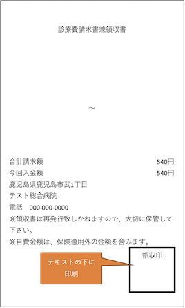

# 設定手順

本アプリは各種設定が完了するまでアプリケーション動作を行わないため、必ず以下の設定を行うこと。

## 1. Bluetooth接続

iPad本体の設定で以下のBluetooth機器との接続を行う。

   - STORES決済端末
   - レシートプリンタ

      ※設定方法はここでは省略。各種マニュアルを参照

      設定例：

      

      - STORES決済端末（画像上）
      - レシートプリンタ（画像下）

## 2. つり銭機設定

- グローリーR08
   1. ネットワーク設定

      「YRT-R08-MN_(簡単インターフェース仕様書)_つり銭機アダプタ_(TMB4-B211-00).pdf」の以下の項を参照すること

      - 3.3. アダプタ設定ファイル作成
      - 3.4. アダプタ設定ファイルロード手順

- グローリー300
   1. ネットワーク設定

      ここでは省略。Ethernet-シリアル変換器（REX-ET60）のマニュアルを参照すること

   1. 本体設定
      1. 工注設定で工場出荷時の設定に戻す
         - 何かしらの設定がmレジアプリとの通信に影響を与えることを避けるため必ず行うこと。

            【事例】中古のつり銭機で精査コマンドのフォーマットが異なり通信に失敗した

      1. 以下のモードに設定する

         - 預かり金計数モード
         - 連動残置

- グローリー380

   「グローリー300」と同じ

## 3. アプリケーション設定

最初の画面の右上にある「設定」ボタンをクリックして、アプリケーション設定を行う。  
設定が必要な項目を以下に示す。環境に合わせて設定すること。 

1. バーコード設定

   決済開始に使用するバーコードを環境に合わせて設定すること

   |モード|説明|
   |---|---|
   |領収書バーコードモード|領収書に印字された金額バーコードを読み取り精算を開始する **バーコードセルフ精算時に使用**|
   |診察券バーコードモード|診察券に印字された患者番号バーコードを読み取り精算を開始する **セルフ精算時に使用**|

1. 診察券精算設定（診察券バーコードモード時のみ）

   - 患者番号取り扱い設定　※複数項目が有効な場合は上から順に適用
      |項目|説明|デフォルト値|
      |---|---|---|
      |数値のみ使用|数値のみ使用を有効にするかどうか  例：065432A → 065432|無効|
      |下位N桁使用|下位N桁使用を有効にするかどうか|無効|
      |桁数|下位何桁を取り扱うかを設定する ※「下位N桁使用」が有効時のみ  例：5を指定した場合、7654321 → 54321|なし|
      |下位X桁削除|下位N桁削除を有効にするかどうか|無効|
      |桁数|下位何桁を削除するかどうかを設定する ※「下位X桁削除」が有効時のみ ※「下位N桁使用の桁数」より小さい値を設定する必要がある  例：1を指定した場合、7654321 → 765432|なし|
      |前ゼロ削除|前ゼロ削除を有効にするかどうか  例：0054321 → 54321|無効|

   - 請求データ検索設定
   
      |項目|説明|
      |---|---|
      |検索対象期間[月]|0: 当日のみ 1〜: (N-1)カ月前の月初から当日まで  ※検索対象はスマレジ仮販売データ ※設定値の詳細は表の下に記載|
      
      - 検索対象期間[月]について

         - 例えば、当日が5月13日の場合 
            |設定値|説明|具体的な期間|
            |---|---|---|
            |0|当日のみ|5/13 00:00:00 〜 5/13 23:59:59|
            |1|今月の月初から当日まで|5/1 00:00:00 〜 5/13 23:59:59|
            |2|1カ月の月初から当日まで|4/1 00:00:00 〜 5/13 23:59:59|
            |3|2カ月の月初から当日まで|3/1 00:00:00 〜 5/13 23:59:59|

         - ※ なお、件数制限は10件固定（変更不可）

   - 医療システム連携設定
      |項目|説明|
      |---|---|
      |ORCA連携|ORCAと連携する時に設定する|
      |MIU連携|MIU連携と連携する時に設定する|
      |CSV連携|MIU以外の電子カルテと連携などと連携する時に設定する|

      - ORCA入金設定

         ※ORCA連携時に有効

         |項目|説明|
         |---|---|
         |ORCA入金処理|決済完了後にORCAへの入金登録／入金取消を行うかどうか|

   - 診療費請求書兼領収書と診療費明細書の設定
      |項目|説明|デフォルト値|
      |---|---|---|
      |診療費請求書兼領収書と診療費明細書を印刷する|診療費請求書兼領収書と診療費明細書を印刷するかどうかを選択する。|有効|
      |領収印を印刷する|診療費請求書兼領収書に領収印を印刷するかどうかを選択する。 ※診療費請求書兼領収書と診療費明細書を印刷するが有効時のみ ※領収印は右下に印刷   有効にする場合、領収印を以下のように配置すること。 ・ファイルアプリ > このiPad内 > mレジ_セルフ > Ryoshuin > ryoshuin.png ※ディレクトリが存在しない場合は、本アプリを起動することで生成される ※**ファイル名は固定**|有効|
      |診療費請求書兼領収書と診療費明細書の間で紙を切る|診療費請求書兼領収書と診療費明細書の間で紙を切るかどうかを選択する。|有効|

   - 処方箋引換券印刷設定
      |項目|説明|デフォルト値|
      |---|---|---|
      |処方箋引換券を印刷する|処方箋引換券を印刷するかどうかを選択する|有効|

1. MIU連携プログラム通信設定

   - 通信設定
      |項目|説明|
      |---|---|
      |MIU連携プログラムAPIのエンドポイントURL|例：http://xxx.xxx.xxx.xxx:8080 IPアドレス：MIU連携プログラムを稼働させたWindowsマシンのIPアドレス ポート番号：MIU連携プログラムがリッスンするポート番号|
      |HTTPレスポンス待ち時間[秒]|MIU連携プログラムが以下のシーケンスをこなすのに十分な時間を設定すること。 １）MIUからAPIで各種データ取得 ２）スマレジに仮販売データを登録 ３）TSIクラウドに領収証・診療明細書を登録|
      
   - 通信設定確認
      |項目|説明|
      |---|---|
      |MIU連携プログラム通信確認|MIU連携プログラムと疎通できるかどうかを確認|

1. つり銭機通信設定

   使用する機種を選択し、通信設定を行う。

   - グローリーR08を使う

      1. 対応機種
         |機種|
         |---|
         |グローリーR08|

      1. 通信設定
         |項目|説明|
         |---|---|
         |IPアドレス|つり銭機アダプタ（グローリー YRT-R08-MN）のIPアドレスを設定|
         |通信確認|機器と疎通ができるかどうかを確認|

   - グローリー300を使う

      1. 対応機種

         |機種|
         |---|
         |グローリー300|
         |グローリー380|

      1. 通信設定
         |項目|説明|
         |---|---|
         |IPアドレス|Ethernet-シリアル変換器（REX-ET60）のIPアドレスを設定|
         |通信確認|機器と疎通ができるかどうかを確認|

1. クレジットカード支払い設定

   |項目|説明|
   |---|---|
   |STORES決済を利用する|STORES決済を利用しない場合は「決済方法選択画面」でクレジットボタンを表示しない ※有効から無効に変更時、自動的にSTORESログアウト処理を行う|
   |STORESログイン|ログインとプリンタの自動印刷設定を行う ※STORES決済を利用する場合のみ有効 **プリンタの自動印刷設定は「バージョン2.0以降」では不要（設定自体ができないようにしてある）**|

   - 手順

      **プリンタの自動印刷設定は「バージョン2.0以降」では不要（設定自体ができないようにしてある）**

      

      設定完了後は「完了」→「戻る」→「キャンセル」→「キャンセル」を順にクリックしアプリケーション設定画面に戻ること。

1. スマレジ通信設定

   - 通信設定
      |項目|説明|
      |---|---|
      |契約ID|スマレジの契約ID|
      |アクセストークンAPIのエンドポイントURL|※1を参照|
      |クライアントID|スマレジDevelopers→アプリ→パブリックアプリ→環境設定のクライアントID|
      |クライアントシークレット|スマレジDevelopers→アプリ→パブリックアプリ→環境設定のクライアントシークレット|
      |プラットフォームAPIのエンドポイントURL|※1を参照|
      
      - ※1 各APIのエンドポイントURLは以下の通り
      
         |サンドボックス環境|本番環境|
         |---|---|
         |アクセストークンAPI|https://id.smaregi.dev|https://id.smaregi.jp|
         |プラットフォームAPI	|https://api.smaregi.dev|https://api.smaregi.jp|

         参照： https://developers.smaregi.dev/apidoc/common/#section/API

   - 通信設定確認
      |項目|説明|
      |---|---|
      |スマレジ通信確認|クラウドサービスと疎通できるかどうかを確認。 本バージョンでは通信設定の各項目の正しさを検証|

   - 取引登録設定

      バーコード設定によって必須項目が異なる

      |項目|説明|領収書バーコードモード時設定|診察券バーコードモード時設定|
      |---|---|---|---|
      |店舗ID|スマレジのクラウドサービスで登録した店舗のIDを設定|○|×|
      |端末ID|スマレジアプリインストール時に自動採番されるID スマレジのクラウドサービスで確認|○|○|
      |商品ID|スマレジのクラウドサービスで登録した商品のIDを設定|○|×|

      ※ 本バージョンの通信確認では取引登録設定の各項目の正しさは検証しないため、入力ミスに注意すること。

1. TSIクラウドスマレジForMedical取引履歴+α通信設定

   - 通信設定
      |項目|説明|
      |---|---|
      |契約ID|スマレジの契約ID|
      |エンドポイントURL|smaregimAPIのエンドポイントURL 例：https://smaregim.jp:4430|
      |クライアントID|smaregimAPIのアクセスに必要なクライアントID|
      |クライアントシークレット|smaregimAPIのアクセスに必要なクライアントシークレット|

   - 通信設定確認
      |項目|説明|
      |---|---|
      |通信確認|クラウドサービスと疎通できるかどうかを確認。 本バージョンでは通信設定の各項目の正しさを検証|

1. レシートプリンタ設定

   STORES決済を利用する場合のレシート印刷や診療費請求書兼領収書印刷など、レシートプリンタを使用する場合のみ有効

   - BLUETOOTH通信設定
      |項目|説明|
      |---|---|
      |BDアドレス|設定ボタンをタップし、列挙されたプリンタを選択すること ※列挙されない場合はiPad本体のBluetooth設定でペアリングを行うこと|

   - 通信設定確認
      |項目|説明|
      |---|---|
      |通信確認|プリンタと通信できるかどうかを確認。 本バージョンでは実際の印刷は行わない|

   - プリンタ設定値
      |項目|説明|初期値|
      |---|---|---|
      |ドット密度|プリンタの設定や仕様に合わせて設定すること ・TM-m30の場合：203|203|
      |印字幅[mm]|プリンタの設定や仕様に合わせて設定すること ・TM-m30で80mm紙幅ロール紙を使う場合：72|72|

1. ORCA通信設定

   - 稼働環境
      |項目|説明|
      |---|---|
      |ORCA稼働環境|WebORCA オンプレ|

   - 通信設定

      稼働環境設定によって必須項目が異なる

      |項目|説明|WebORCA時設定|オンプレ時設定|
      |---|---|---|---|
      |日医標準レセプトソフトHAORIのエンドポイントURL|環境に合わせて設定すること|○|○|
      |クライアント証明書ファイル(PKCS12#形式)|ORCAに接続するためのクライアント認証情報。  以下のディレクトリ直下に配置されたファイルが列挙されるため、ファイルを選択すること ・ファイルアプリ > このiPad内 > mレジ_セルフ精算 > Cert ※ディレクトリが存在しない場合は、本アプリを起動することで生成される|○|×|
      |クライアント証明書のパスワード|ORCAに接続するためのクライアント認証情報。|○|×|
      |クライアントID|同上|○|○|
      |APIキー|同上|○|×|
      |クライアントパスワード|同上|×|○|
      |カルテUID（自動生成）|初回起動時に自動生成される。設定不可|○|○|

   - 通信設定確認
      |項目|説明|
      |---|---|
      |通信確認|ORCAと疎通できるかどうかを確認。 本バージョンでは通信設定の各項目の正しさを検証|

   - 入金登録設定
      |項目|説明|初期値|
      |---|---|---|
      |現金の入金方法コード|ORCAの入金方法情報マスタ(1041)の登録内容に合わせる。 環境に合わせて設定すること|01|
      |クレジットカードの入金方法コード|入金方法情報マスタ(1041)の登録内容に合わせる。 環境に合わせて設定すること||

1. 画面設定

   - 精算待機画面設定
      |項目|説明|初期値|
      |---|---|---|
      |精算待機画面の背景画像|以下のディレクトリに背景画像を１つだけ配置すること ・ファイルアプリ > このiPad内 > mレジ_セルフ > BGImage > stanby ※**ファイル名は任意** ※ディレクトリが存在しない場合は、本アプリを起動することで生成される  環境に合わせて設定すること|SUNMI社製バーコードリーダの画像（※領収書バーコードモードと診察券バーコードモードで画像が自動的に切り替わる）|

   - 精算完了画面設定
      |項目|説明|初期値|
      |---|---|---|
      |精算完了メッセージ表示時間[秒]|環境に合わせて設定すること|5|
      |精算完了時のメッセージ（おつりがない場合）|環境に合わせて設定すること|精算が完了しました。気をつけてお帰りください|
      |精算完了時のメッセージ（おつりがある場合）|環境に合わせて設定すること|おつりをお受け取りの上、気をつけてお帰りください|
      |処方箋引換券の受け取り案内メッセージ（処方箋引換券を印刷した場合）|環境に合わせて設定すること|処方箋引換券を受け取って受付へお越しください|

1. ログ出力設定

   設定が必要な項目はありません。
